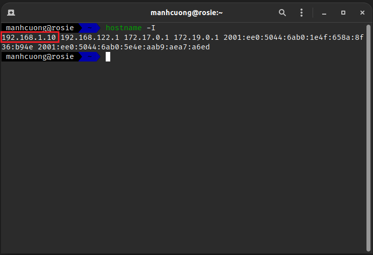
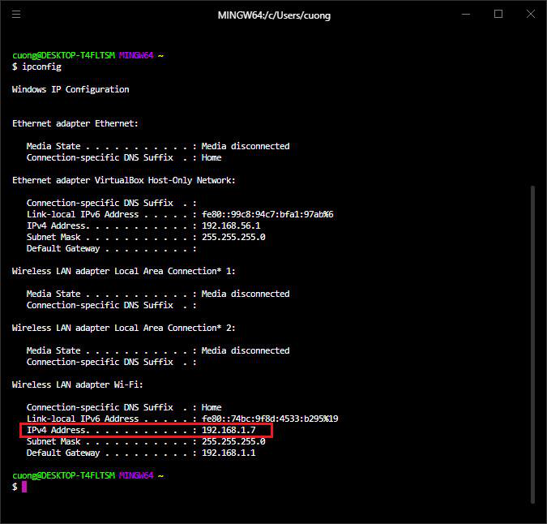

# 3. The Internet and IP Addresses
* Để hai socket từ hai máy tính độc lập nhau có thể giao tiếp được với nhau trên cùng một network thông qua một port nào đó, thì trước tiên ta cần phải có **IPv4** trên hai máy tính, cách lấy địa chỉ IPv4 như sau:
  * Đối với Linux, mở terminal và gõ lệnh:
    ```
    hostname -I
    ```
    vùng được khoanh đỏ ở hình bên dưới là địa chỉ IPv4 của máy chạy Linux.
    

  * Đối với Windows, mở command prompt và gõ lệnh:
    ```
    ipconfig
    ```
    vùng được khoanh đỏ ở hình bên dưới là địa chỉ IPv4 của máy chạy Windows.
    