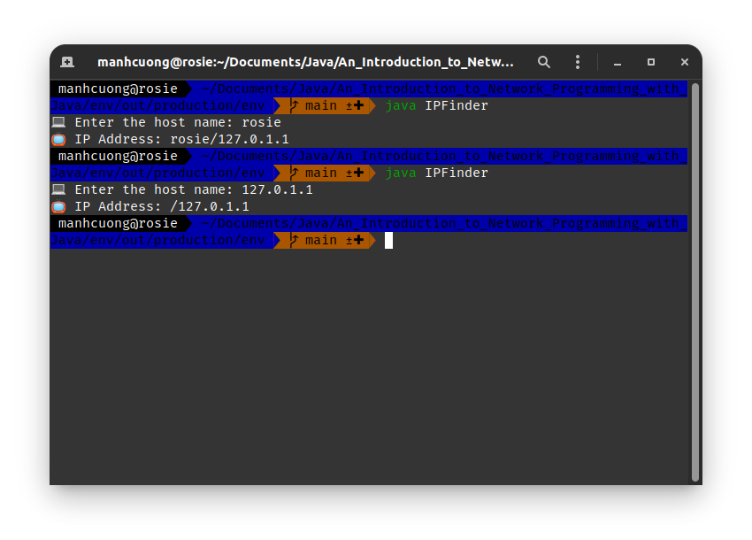
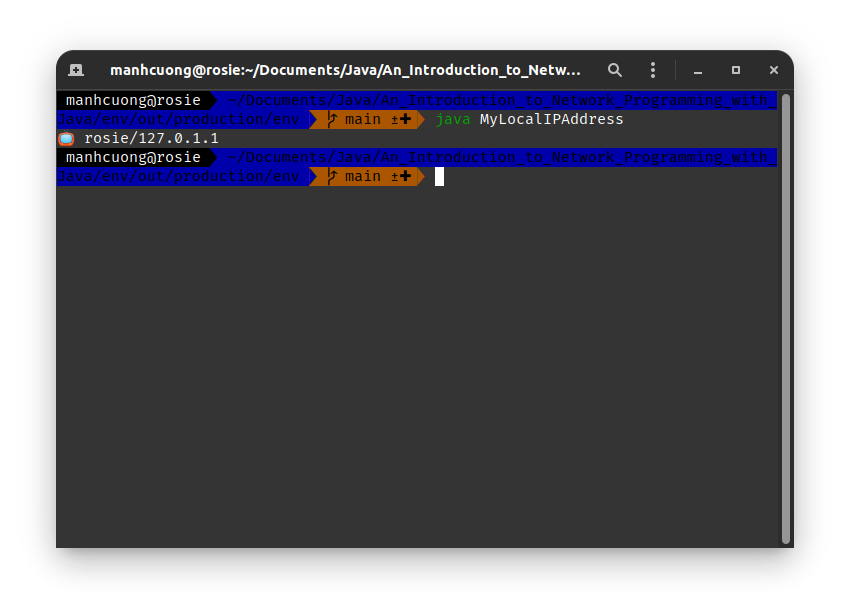
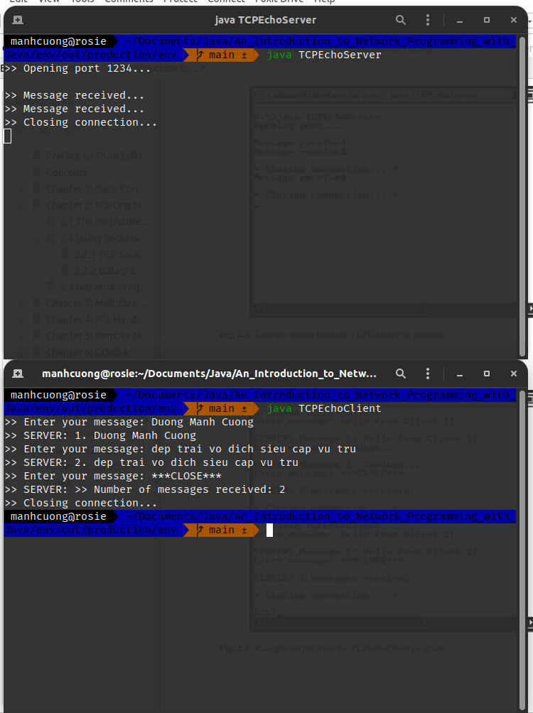
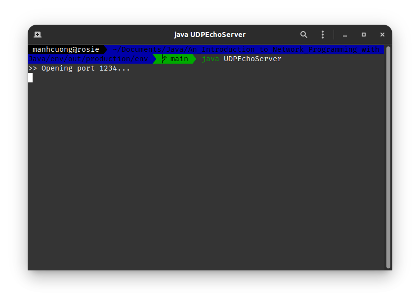
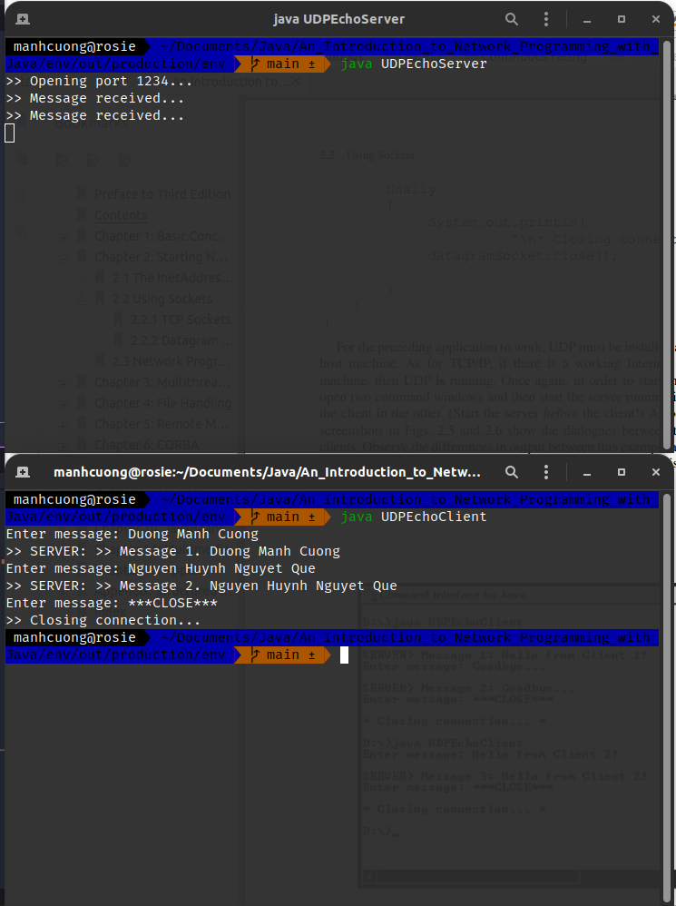
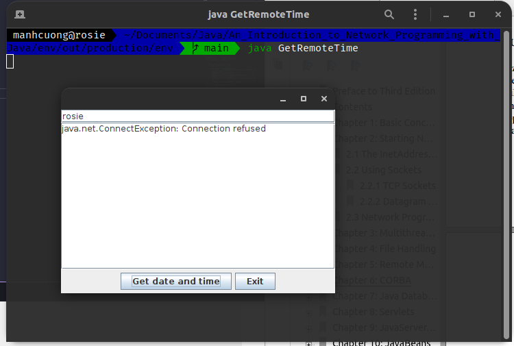
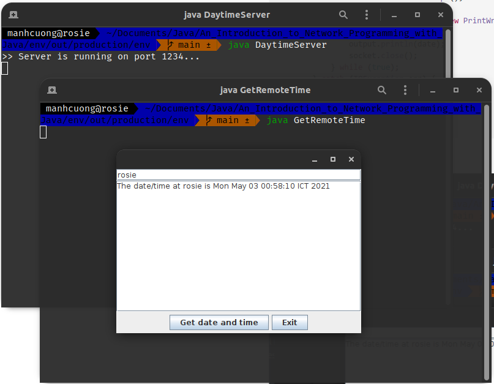
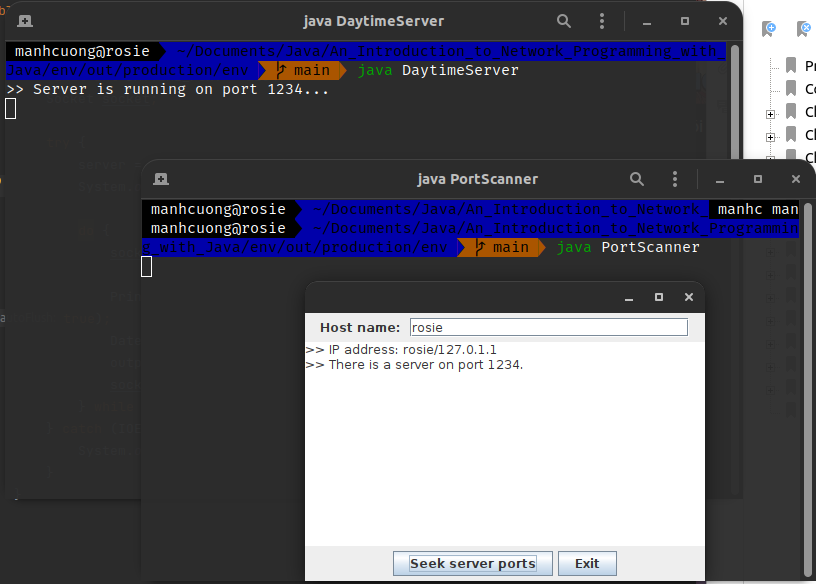
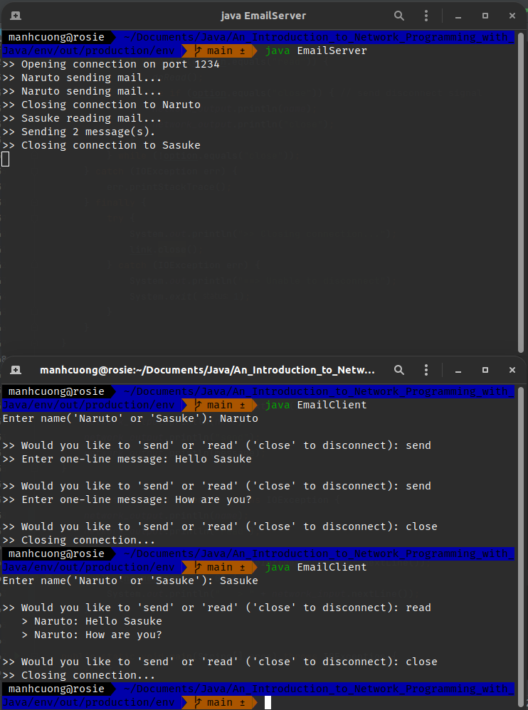

# 1. The `InetAddress` Class
* Nhập vào **hostname** sẽ trả về **địa chỉ IP** của hostname đó.
###### IPFinder.java _[source code](IPFinder.java)_
```java
import java.net.*;
import java.util.*;

public class IPFinder {
    public static void main(String[] args) {
        String host;
        Scanner input = new Scanner(System.in);
        InetAddress address;

        System.out.print("\uD83D\uDCBB Enter the host name: ");
        host = input.next();

        try {
            address = InetAddress.getByName(host);
            System.out.println("\uD83D\uDCFA IP Address: " + address.toString());
        } catch (UnknownHostException err) {
            System.out.println("\uD83D\uDEAB Could not find " + host);
        }
    }
}
```


<hr>

* Chương trình lấy ra thông tin **hostname** và **địa chỉ IP** của máy hiện tại.
###### MyLocalIPAddress.java _[source code](MyLocalIPAddress.java)_
```java
import java.net.*;

public class MyLocalIPAddress {
    public static void main(String[] args) {
        try {
            InetAddress address = InetAddress.getLocalHost();
            System.out.println("\uD83D\uDCFA " + address);
        } catch (UnknownHostException err) {
            System.out.println("\uD83D\uDEAB Could not find your local address!");
        }
    }
}
```


# 2. Using Sockets
## 2.1. TCP Sockets
* Một liên kết giao tiếp dc tạo bằng TCP/IP là một liên kết **hướng kết nối**. Điều này có nghĩa là kết nối giữa server và client vẫn sẽ mở trong suốt quá trình diễn ra cuộc "đối thoại" giữa server và client và chỉ đóng khi server hoặc client thực hiện "chấm dứt kết nối". 
* Trước tiên chúng ta sẽ tiếp cận bên phía server trước, để thiết lập socket cho server cần 5 bước.
  * **Bước 1**: Tạo ra đối tượng `ServerSocket`.
    * Constructor `ServerSocket` cần truyền vào một tham số gọi là **port**. Ví dụ:
      ```java
      ServerSocket serversocket = new ServerSocket(1234); // port là 1234
      ```
    * Ở ví dụ trên, server sẽ chờ một kết nối nào đó từ client trên port 1234.  
  * **Bước 2**: Đặt server vào trạng thái "chờ".
    * Server sẽ tiến hành chờ một kết nối nào đó từ client đến nó. Server thực hiện dc điều này bằng cách gọi p.thức `ServerSocket.accept`, p.thức này trả về một object socket khi server đã chấp nhận kết nối từ phía client. Ví dụ:
      ```java
      Socket link = serversocket.accept();
      ``` 
  * **Bước 3**: Thiết lập **input** và **output stream**.
    * P.thức `getInputStream` và `getOutputStream` của class `Socket` dc s.dụng để tham chiếu đến các **stream** mà socket trả về ở _**bước 2**_. Các stream này dc dùng để g.tiếp vs client vừa kết nối. Ví dụ dưới đây là dùng để lấy nội dung mà client gửi qua cho server qua stream:
    ```java
    Scanner input = new Scanner(link.getInputStream());
    ``` 
    * Bây giờ, chúng ta cần tạo một **chiếc hộp** chứa tất cả mọi thứ mà server muốn gửi cho client, chiếc hộp này dc tạo thông qua object `PrintWriter`, đối số  thứ hai mang giá trị `true` sẽ tiến hành xóa bộ đêm _(chung cũng méo biết nó là gì)_.
    ```java
    PrintWriter output = new PrintWriter(link.getOutputStream(), true);
    ```
  * **Bước 4**: Gửi và nhận dữ liệu.
    * Sử dụng p.thức `nextLine` để nhận dữ liệu và `println` để gửi dữ liệu. Ví dụ:
    ```java
    output.println("Gửi dữ liệu...");
    String input = input.nextLine(); // nhận dữ liệu
    ```
  * **Bước 5**: Đóng kết nối _(sau khi đã hoàn thành cuộc **"đối thoại"**)_.
    ```java
    link.close();
    ```
* Dưới đây là một ví dụ minh họa cho 5 bước trên:
  * Một server tiến hành nhận các tin nhắn từ client, các tin nhắn mà client gửi đến sẽ dc server đánh số và gửi lại client tin nhắn này kèm theo số dc đánh cho tin nhắn đó. Server và client sẽ luân phiên gửi qua gửi lại như vậy cho đến khi client gửi tin nhắn '***CLOSE***' khi muốn dừng kết nối. Khi máy chủ nhận dc tin nhắn muốn đóng kết nối này, server sẽ tiến hành đóng kết nối đến client này.
* Dưới đây là code demo cho toàn bộ những lí thuyết trên, cụ thể tiến hành mở một port 1234 và chờ một kết nối từ client nào đó:
###### TCPEchoServer.java _[source code](TCPEchoServer.java)_
```java
import java.io.*;
import java.net.*;
import java.util.*;

public class TCPEchoServer {
    private static ServerSocket server_socket;
    private static final int PORT = 1234;

    private static void handleClient() {
        Socket link = null; // bước 2

        try {
            link = server_socket.accept(); // bước 2
            Scanner input = new Scanner(link.getInputStream()); // bước 3
            PrintWriter output = new PrintWriter(link.getOutputStream(), true); // bước 3

            int num_messages = 0;
            String message; // bước 4

            while (true) {
                message = input.nextLine();

                if (message.equals("***CLOSE***")) {
                    output.println(">> Number of messages received: " + num_messages); // bước 4

                    break;
                }

                System.out.println(">> Message received...");
                output.println(++num_messages + ". " + message); // bước 4
            }

        } catch (IOException err) {
            err.printStackTrace();
        } finally {
            try {
                System.out.println(">> Closing connection...");
                link.close(); // bước 5
            } catch (IOException err) {
                System.out.println("==> Unable to disconnect...");
                System.exit(1);
            }
        }
    }

    public static void main(String[] args) {
        System.out.println(">> Opening port " + PORT + "...\n");

        try {
            server_socket = new ServerSocket(PORT); // bước 1
        } catch (IOException err) {
            System.out.println("==> Unable to attach to port!");
            System.exit(1);
        }

        do {
            handleClient();
        } while (true);
    }
}
```


<hr>

* Bây giờ chúng ta sẽ tiến hành thiết lập cho client, bao gồm 4 bước:
  * **Bước 1**: Thiếp lập kết nối đến máy chủ.
    * Chúng ta cần tạo ra một socket object, bao gồm **hai đối số**:
      * Địa chỉ IP của server.
      * Port mà server cung cấp dịch vụ mà client cần.
    * Để đơn giản, chúng ta sẽ đặt server và client trên cùng một máy chủ, điều này sẽ cho phép truy xuất dễ dàng đến địa chỉ IP thông qua p.thức `InetAddress.getLocalHost`. Ví dụ:
      ```java
      Socket link = new Socket(InetAddress.getLocalHost(), 1234);
      ```
  * **Bước 2**: Thiếp lập input và output stream.
    * Làm tương tự như cách ta làm cho server.
  * **Bước 3**: Gửi và nhận dữ liệu.
    * Tương tư cách làm ở server.
  * **Bước 4**: Đóng kết nối.
    * Tương tự như server luôn 😅.
* Dưới đây là code demo, lưu ý ta cần phải khởi chạy server trc sau đó mới chạy client, nếu ko sẽ xảy ra lỗi.

###### TCPEchoClient.java _[source code](TCPEchoClient.java)_
```java
import java.net.*;
import java.io.*;
import java.util.*;

public class TCPEchoClient {
    private static InetAddress host;
    private static final int PORT = 1234;

    private static void accessServer() {
        Socket link = null; // bước 1

        try {
            link = new Socket(host, PORT); // bước 1
            Scanner input = new Scanner(link.getInputStream()); // bước 2
            PrintWriter output = new PrintWriter(link.getOutputStream(), true); // bước 2
            Scanner user_entry = new Scanner(System.in);

            String message, response;

            do {
                System.out.print(">> Enter your message: ");
                message = user_entry.nextLine();
                output.println(message); // bước 3
                response = input.nextLine(); // bước 3
                System.out.println(">> SERVER: " + response);
            } while (!message.equals("***CLOSE***"));
        } catch (IOException err) {
            err.printStackTrace();
        } finally {
            try {
                System.out.println(">> Closing connection...");
                link.close();
            } catch (IOException err) {
                System.out.println("==> Unable to disconnect!");
                System.exit(1);
            }
        }
    }

    public static void main(String[] args) {
        try {
            host = InetAddress.getLocalHost();
        } catch (UnknownHostException err) {
            System.out.println("==> Host ID not found...");
            System.exit(1);
        }

        accessServer();
    }
}
```


## 2.2. Datagram (UDP) Sockets
* Không giống như TCP/IP, UDP là **ko kết nối**. Điều này có nghĩa là kết nối giữa server và client ko dc duy trì trog suốt thời gian của cuộc hội thoại. Thay vào đó các gói của UDP sẽ dc gửi đi chỉ khi cần thiết.
* Vì kết nối ko dc duy trì giữa các phiên, cho nên server ko cần phải tạo một object socket riêng biệt cho từng client như đã làm cho TCP/IP. Thay vì tạo một object `ServerSocket`, server sẽ tạo một object `DatagramSocket`.
* Trc tiên, ta sẽ thiết lập ở phía server trc, bao gồm 9 bước:
  * **Bước 1**: Tạo ra object `DatagramSocket` với đối số là port.
    ```java
    DatagramSocket datagram_socket = new DatagramSocket(1234);
    ``` 
  * **Bước 2**: Tạo bộ đệm cho các gói tin.
    ```java
    byte[] buffer = new byte[256];
    ```
  * **Bước 3**: Tạo object `DatagramPacket` cho các gói dữ liệu đến, gồm hai đối số là mảng `buffer` và kích thước của mảng `buffer` này.
    ```java
    DatagramPacket in_packet = new DatagramPacket(buffer, buffer.length);
    ```
  * **Bước 4**: Chấp nhận các gói tin đến.
    ```java
    datagram_socket.receive(in_packet);
    ```
  * **Bước 5**: Chấp nhận IP và port của client gửi gói tin.
    ```java
    InetAddress client_address = in_packet.getAddress();
    int client_port = in_packet.getPort();
    ```   
  * **Bước 6**: Nhận dữ liệu từ `in_packet`.
    * Để thuận tiện cho việc xử lí, dữ liệu sẽ dc casting sang `String` bằng cách sử dụng overloading-constructor của `String` gồm 3 đối số:
      * `in_packet`.
      * vị trí bắt đầu cast trong `in_packet`, ở đây luôn là 0.
      * số byte cần lấy, luôn là `in_packet.getLength()`.    
      ```java
      String message = new String(in_packet.getData(), 0, in_packet.getLength());
      ``` 
  * **Bước 7**: Tạo ra gói tin response.
  * **Bước 8**: Gửi gói tin response.
  * **Bước 9**: Đóng `DatagramSocket`.

###### UDPEchoServer.java _[source code](UDPEchoServer.java)_
```java
import java.io.*;
import java.net.*;
import java.nio.charset.StandardCharsets;

public class UDPEchoServer {
    private static final int PORT = 1234;
    private static DatagramSocket datagram_socket;
    private static DatagramPacket in_packet, out_packet;
    private static byte[] buffer;

    public static void handleClient() {
        try {
            String message_in, message_out;
            int num_messages = 0;
            InetAddress client_address = null;
            int client_port;

            do {
                buffer = new byte[256]; // bước 2
                in_packet = new DatagramPacket(buffer, buffer.length); // bước 3
                datagram_socket.receive(in_packet); // bước 4
                client_address = in_packet.getAddress(); // bước 5
                client_port = in_packet.getPort(); // bước 6

                message_in = new String(in_packet.getData(), 0, in_packet.getLength()); // bước 6
                System.out.println(">> Message received...");
                message_out = ">> Message " + ++num_messages + ". " + message_in;

                out_packet = new DatagramPacket(message_out.getBytes(), message_out.length(), client_address, client_port); // bước 7
                datagram_socket.send(out_packet); // bước 8
            } while (true);
        } catch (IOException err) {
            err.printStackTrace();
        } finally {
            System.out.println(">> Closing connection...");
            datagram_socket.close(); // bước 9
        }
    }

    public static void main(String[] args) {
        System.out.println(">> Opening port " + PORT + "...");

        try {
            datagram_socket = new DatagramSocket(PORT);
        } catch (SocketException err) {
            System.out.println("==> Unable to open port " + PORT); // bước 1
            System.exit(1);
        }

        handleClient();
    }
}
```


<hr>

* Tiếp theo ta sẽ tiến hành thiết lập cho phía client, bao gồm 8 bước:
  * **Bước 1**: Tạo ra object `DatagramSocket`
  * **Bước 2**: Tạo gói tin gửi đi.
  * **Bước 3**: Gửi gói tin gửi đi.
  * **Bước 4**: Nhận buffer từ gói tin trả về.
  * **Bước 5**: Tạo object `DatagramPacket` cho gói tin trả về.
  * **Bước 6**: Chấp nhận gói tin trả về.
  * **Bước 7**: Lấy dữ liệu từ buffer.
  * **Bước 8**: Đóng kết nối `DatagramSocket`

* Nên nhớ phải chạy server trc sau đó mới chạy client, dưới đây là code demo cho client:
###### UDPEchoClient.java _[source code](UDPEchoClient.java)_
```java
import java.io.*;
import java.net.*;
import java.util.*;

public class UDPEchoClient {
    private static InetAddress host;
    private static final int PORT = 1234;
    private static DatagramSocket datagram_socket;
    private static DatagramPacket in_packet, out_packet;
    private static byte[] buffer;

    private static void accessServer() {
        try {
            datagram_socket = new DatagramSocket(); // bước 1
            Scanner user_entry = new Scanner(System.in);
            String message = "", response = "";

            do {
                System.out.print("Enter message: ");
                message = user_entry.nextLine();

                if (!message.equals("***CLOSE***")) {
                    out_packet = new DatagramPacket(message.getBytes(), message.length(), host, PORT); // bước 2
                    datagram_socket.send(out_packet); // bước 3
                    buffer = new byte[256]; // bước 4
                    in_packet = new DatagramPacket(buffer, buffer.length); // bước 5
                    datagram_socket.receive(in_packet); // bước 6
                    response = new String(in_packet.getData(), 0, in_packet.getLength()); // bước 7

                    System.out.println(">> SERVER: " + response);
                }
            } while (!message.equals("***CLOSE***"));
        } catch (IOException err) {
            err.printStackTrace();
        } finally {
            System.out.println(">> Closing connection...");
            datagram_socket.close(); // bước 8
        }
    }

    public static void main(String[] args) {
        try {
            host = InetAddress.getLocalHost();
        } catch (UnknownHostException err) {
            System.out.println("==> Host ID not found!");
            System.exit(1);
        }

        accessServer();
    }
}
```


# 3. Networking Programming with GUIs
* Dưới đây là chương trình GUI cho phép nhập vào IP hoăc hostname của server sau đó nhấn button *Get date and time* server sau đó sẽ trả về ngày giờ hiện tại của server.

###### GetRemoteTime.java _[source code](GetRemoteTime.java)_
```java
import javax.swing.*;
import java.awt.*;
import java.awt.event.ActionEvent;
import java.awt.event.ActionListener;
import java.awt.event.WindowAdapter;
import java.awt.event.WindowEvent;
import java.net.*;
import java.io.*;
import java.util.*;

public class GetRemoteTime extends JFrame implements ActionListener {
    private JTextField host_input;
    private JTextArea display;
    private JButton time_btn;
    private JButton exit_btn;
    private JPanel button_pnl;
    private static Socket socket = null;

    public GetRemoteTime() {
        host_input = new JTextField(20);
        add(host_input, BorderLayout.NORTH);

        display = new JTextArea(10, 15);
        display.setWrapStyleWord(true);
        display.setLineWrap(true);
        add(new JScrollPane(display), BorderLayout.CENTER);

        button_pnl = new JPanel();
        time_btn = new JButton("Get date and time");
        time_btn.addActionListener(this);
        button_pnl.add(time_btn);

        exit_btn = new JButton("Exit");
        exit_btn.addActionListener(this);
        button_pnl.add(exit_btn);
        add(button_pnl, BorderLayout.SOUTH);
    }

    public void actionPerformed(ActionEvent ev) {
        if (ev.getSource() == exit_btn) {
            System.exit(0);
        }

        String the_time;
        String host = host_input.getText();
        final int DAYTIME_PORT = 1234;

        try {
            socket = new Socket(host, DAYTIME_PORT);
            Scanner input = new Scanner(socket.getInputStream());
            the_time = input.nextLine();
            display.append("The date/time at " + host + " is " + the_time + "\n");
            host_input.setText("");
        } catch (UnknownHostException err) {
            display.append("==> No such host!\n");
            host_input.setText("");
        } catch (IOException err) {
            display.append(err.toString() + "\n");
        } finally {
            try {
                if (socket != null) {
                    socket.close();
                }
            } catch (IOException err) {
                System.out.println("==> Unable to disconnect!");
                System.exit(1);
            }
        }
    }

    public static void main(String[] args) {
        GetRemoteTime frame = new GetRemoteTime();
        frame.setSize(400, 300);
        frame.setVisible(true);
        frame.addWindowListener(
            new WindowAdapter() {
                public void windowClosing(WindowEvent ev) {
                    // check whether a socket is open
                    if (socket != null) {
                        try {
                            socket.close();
                        } catch (IOException err) {
                            System.out.println("==> Unable to close link!");
                            System.exit(1);
                        }
                    }

                    System.exit(0);
                }
            }
        );
    }
}
```

> * Ko thể truy cập dc do server chưa chạy.

###### DaytimeServer.java _[source code](DaytimeServer.java)_
```java

import java.net.*;
import java.io.*;
import java.util.Date;

public class DaytimeServer {
    public static void main(String[] args) {
        ServerSocket server;
        final int DAYTIME_PORT = 1234;
        Socket socket;

        try {
            server = new ServerSocket(DAYTIME_PORT);
            System.out.println(">> Server is running on port " + DAYTIME_PORT + "...");

            do {
                socket = server.accept();

                PrintWriter output = new PrintWriter(socket.getOutputStream(), true);
                Date date = new Date();
                output.println(date);
                socket.close();
            } while (true);
        } catch (IOException err) {
            System.out.println("==> " + err);
        }
    }
}
```

* Nhớ phải chạy server trc.



<hr>

* Dưới đây là chương trình dùng để quét các cổng port đang mở trên server.
###### PortScanner.java _[source code](PortScanner.java)_
```java
import java.awt.*;
import java.awt.event.*;
import javax.swing.*;
import java.net.*;
import java.io.*;

public class PortScanner extends JFrame implements ActionListener {
    private JLabel prompt;
    private JTextField host_input;
    private JTextArea report;
    private JButton seek_btn, exit_btn;
    private JPanel host_pnl, button_pnl;
    private static Socket socket = null;

    public PortScanner() {
        host_pnl = new JPanel();
        prompt = new JLabel("Host name: ");
        host_input = new JTextField("rosie", 25);
        host_pnl.add(prompt);
        host_pnl.add(host_input);
        add(host_pnl, BorderLayout.NORTH);
        report = new JTextArea(10, 25);
        add(report, BorderLayout.CENTER);
        button_pnl = new JPanel();
        seek_btn = new JButton("Seek server ports");
        seek_btn.addActionListener(this);
        button_pnl.add(seek_btn);
        exit_btn = new JButton("Exit");
        exit_btn.addActionListener(this);
        button_pnl.add(exit_btn);
        add(button_pnl, BorderLayout.SOUTH);
    }

    public void actionPerformed(ActionEvent event) {
        if (event.getSource() == exit_btn)
            System.exit(0);

        report.setText("");
        String host = host_input.getText();
        try {
            InetAddress theAddress = InetAddress.getByName(host);
            report.append(">> IP address: " + theAddress + "\n");
            for (int i = 1234; i < 1245; i++) {
                try {
                    socket = new Socket(host, i);
                    report.append(">> There is a server on port " + i + ".\n");
                    socket.close();
                } catch (IOException err) { }
            }
        } catch (UnknownHostException uhEx) {
            report.setText("==> Unknown host!");
        }
    }

    public static void main(String[] args) {
        PortScanner frame = new PortScanner();
        frame.setSize(400, 300);
        frame.setVisible(true);
        frame.addWindowListener(
                new WindowAdapter() {
                    public void windowClosing(WindowEvent event) { // check whether a socket is open…
                        if (socket != null) {
                            try {
                                socket.close();
                            } catch (IOException err) {
                                System.out.println("==> Unable to close link!\n");
                                System.exit(1);
                            }
                        }
                        System.exit(0);
                    }
                }
        );
    }
}
```


<hr>

* Dưới đây là chương trình dùng để nhắn tin giữa hai người.
###### EmailServer.java _[source code](EmailServer.java)_
```java
import java.io.*;
import java.net.*;
import java.util.*;

class InvalidClientException extends Exception {
    public InvalidClientException() {
        super("==> Invalid client name!");
    }

    public InvalidClientException(String message) {
        super(message);
    }
}

class InvalidRequestException extends Exception {
    public InvalidRequestException() {
        super("==> Invalid request!");
    }

    public InvalidRequestException(String message) {
        super(message);
    }
}

public class EmailServer {
    private static ServerSocket server_socket;
    private static final int PORT = 1234;
    private static final String client1 = "Naruto";
    private static final String client2 = "Sasuke";
    private static final int MAX_MESSAGES = 10;
    private static String[] mailbox1 = new String[MAX_MESSAGES];
    private static String[] mailbox2 = new String[MAX_MESSAGES];
    private static int message_inbox1 = 0;
    private static int message_inbox2 = 0;


    private static void runService() throws InvalidClientException, InvalidRequestException {
        try {
            Socket link = server_socket.accept();
            Scanner input = new Scanner(link.getInputStream());
            PrintWriter output = new PrintWriter(link.getOutputStream(), true);
            String name, signal;

            while (true) {
                name = input.nextLine().trim();
                signal = input.nextLine().trim();

                if (!name.equals(client1) && !name.equals(client2)) throw new InvalidClientException();

                if (!signal.equals("send") && !signal.equals("read") && !signal.equals("close"))
                    throw new InvalidRequestException();

                if (signal.equals("close")) {
                    System.out.println(">> Closing connection to " + name);
                    break;
                }

                System.out.println(">> " + name + " " + signal + "ing mail...");
                if (name.equals(client1)) {
                    if (signal.equals("send")) {
                        doSend(mailbox2, message_inbox2, name, input);
                        message_inbox2 += message_inbox2 < MAX_MESSAGES ? 1 : 0;
                    } else {
                        doRead(mailbox1, message_inbox1, output);
                        message_inbox1 = 0;
                    }
                } else { // from `client2`
                    if (signal.equals("send")) {
                        doSend(mailbox1, message_inbox1, name, input);
                        message_inbox1 += message_inbox1 < MAX_MESSAGES ? 1 : 0;
                    } else {
                        doRead(mailbox2, message_inbox2, output);
                        message_inbox2 = 0;
                    }
                }
            }
        } catch (IOException err) {
            err.printStackTrace();
        }
    }

    private static void doSend(String[] mailbox, int message_inbox, String name, Scanner input) {
        String message = input.nextLine().trim();

        if (message_inbox == MAX_MESSAGES) {
            System.out.println("<< Message box full!");
        } else {
            mailbox[message_inbox] = name + ": " + message;
        }
    }

    private static void doRead(String[] mailbox, int message_inbox, PrintWriter output) {
        System.out.println(">> Sending " + message_inbox + " message(s).");
        output.println(message_inbox);
        for (int i = 0; i < message_inbox; ++i) {
            output.println(mailbox[i]);
        }
    }

    public static void main(String[] args) {
        System.out.println(">> Opening connection on port " + PORT);

        try {
            server_socket = new ServerSocket(PORT);
        } catch (IOException err) {
            System.out.println("==> Unable to attach to port!");
            System.exit(1);
        }

        do {
            try {
                runService();
            } catch (InvalidClientException err) {
                System.out.println("==> ERROR: " + err);
            } catch (InvalidRequestException err) {
                System.out.println("==> ERROR: " + err);
            }
        } while (true);
    }
}
```

###### EmailClient.java _[source code](EmailClient.java)_
```java
import java.io.*;
import java.net.*;
import java.util.*;

public class EmailClient {
    private static InetAddress host;
    private static final int PORT = 1234;
    private static String name;
    private static Scanner network_input, user_entry;
    private static PrintWriter network_output;

    private static void talkToServer() throws IOException {
        Socket link = null;

        try {
            link = new Socket(host, PORT);
            network_input = new Scanner(link.getInputStream());
            network_output = new PrintWriter(link.getOutputStream(), true);
            user_entry = new Scanner(System.in);

            String option;

            do {
                System.out.print("\n>> Would you like to 'send' or 'read' ('close' to disconnect): ");
                option = user_entry.nextLine().trim().toLowerCase();

                if (option.equals("send")) {
                    doSend();
                } else if (option.equals("read")) {
                    doRead();
                } else if (option.equals("close")) { // send disconnect signal
                    network_output.println(name);
                    network_output.println("close");
                }
            } while (!option.equals("close"));
        } catch (IOException err) {
            err.printStackTrace();
        } finally {
            try {
                System.out.println(">> Closing connection...");
                link.close();
            } catch (IOException err) {
                System.out.println("==> Unable to disconnect");
                System.exit(1);
            }
        }
    }

    private static void doSend() {
        System.out.print(">> Enter one-line message: ");
        String message = user_entry.nextLine();
        network_output.println(name);
        network_output.println("send");
        network_output.println(message);
    }

    private static void doRead() throws IOException {
        network_output.println(name);
        network_output.println("read");

        int no_messages = Integer.parseInt(network_input.nextLine());
        while (no_messages-- > 0) {
            System.out.println("   > " + network_input.nextLine());
        }
    }

    public static void main(String[] args) throws IOException {
        try {
            host = InetAddress.getLocalHost();
        } catch (UnknownHostException err) {
            System.out.println("==> Host ID not found");
            System.exit(1);
        }

        user_entry = new Scanner(System.in);

        do {
            System.out.print("Enter name('Naruto' or 'Sasuke'): ");
            name = user_entry.nextLine().trim();
        } while (!name.equals("Naruto") && !name.equals("Sasuke"));

        talkToServer();
    }
}
```
