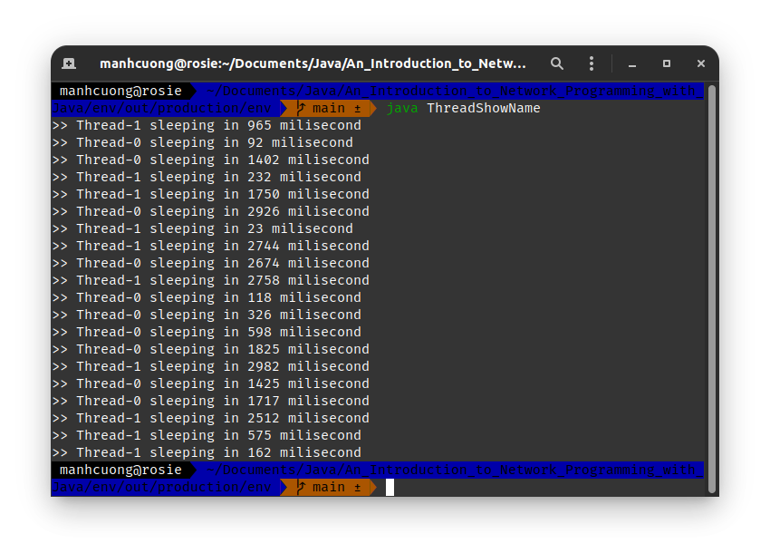
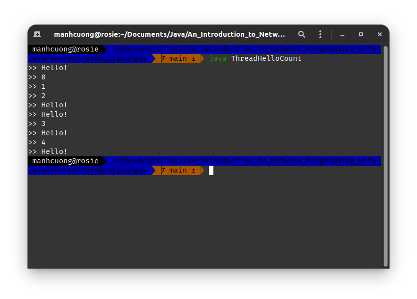
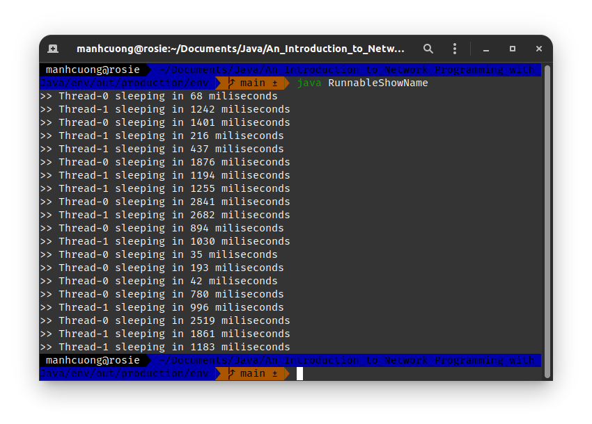
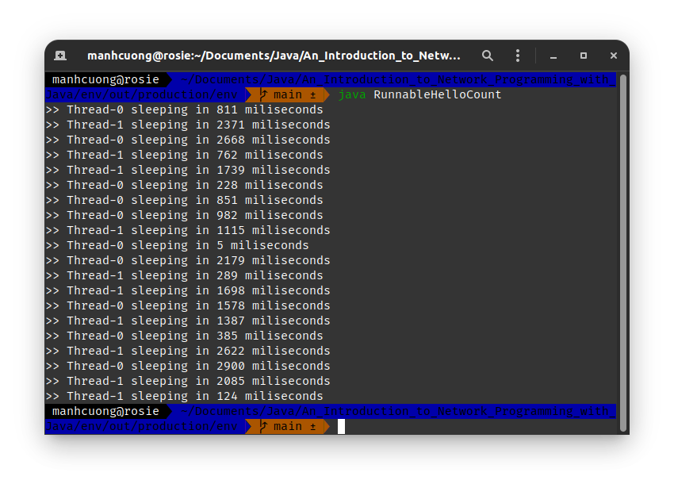
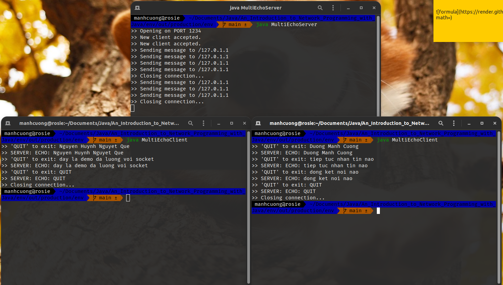
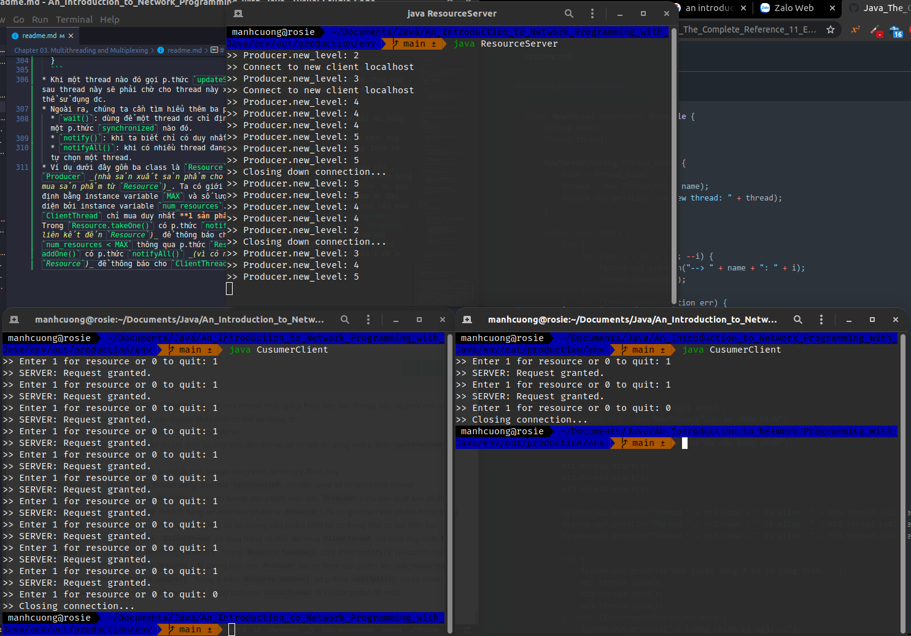

# 1. Thread Basics
* Hãy lấy ví dụ với phần mềm MS Word, khi ta chạy phần mềm MS Word, tức ta đang chạy một process. Mộ process có thể bao gồm nhiều thread, trong đó ỗi thread đảm nhận một chức năng khác nhau trong process, ví dụ trong MS Word có một thread riêng hỗ trợ bắt lỗi chính tả và một thread khác sẽ auto save khi document có sự thay đổi. Các thread ko dc phần bổ vùng nhớ riêng, tức chúng dùng chung vùng nhớ mà process dc cấp bởi HĐH, do đó các thread có thể chia sẻ dữ liệu lẫn nhau.

# 2. Using Threads in Java
* Java hỗ trợ đa luồng, một object trong Java có thể dc chạy trên một thread nếu nó dc implement bởi class `Runnable`, sau đó chúng ta sẽ tiến hành code những mã xử lí cho thread này dựa vào cơ chế overloading-method trên hàm `run`.
* Để tạo ra một thread trong Java, có hai cách:
  * Tạo một class kế thừa từ class `Thread`. Tuy nhiên, cách này có một nhược điểm là vì Java ko hỗ trợ đa kế thừa nên nếu class này của chúng ta đã kế thừa từ một class nào đó thì chúng ta ko thể cho class cần chạy thread kế thừa thêm class `Thread` này dc nữa.
  * Tạo một class implement class `Runnable`. Cách này thường dc áp dụng nhiều hơn.

## 2.1. Extending the Thread Class
* Ta sẽ tiến hành code mọi xử lí của chúng ta trong overloading-method `run`, và sau đó khi chúng ta gọi p.thức `Thread.start()` thì p.thức này sẽ tự động gọi p.thức `run` mà ta ko cần phải gọi nó một cách công khai.
* Class `Thread` có đến 7 constructor, nhưng hai loại dc dùng phổ biến là:
  * `Thread()`, các thread dc tạo ra sẽ dc đánh số từ 0.
  * `Thread(String <name>)`, đơn giản là cho thread một cái tên thui.
* Ngoài ra, ta còn có một p.thức là `Thread.sleep(int <milisecond>)` dc dùng để tạm dừng luồng chỉ định trong một khoảng `<milisecond>` milisecond dc chỉ định và các luồng khác vẫn sẽ chay b.thường. Khi hết thời gian tạm dừng, thread sẽ tiếp tục chạy.
* Một p.thức nữa là `interrupt` dc dùng để ngắt một luồng dc chỉ định, ngoài ra p.thức này còn dc sử dụng bởi một thread khác để đánh thức một luồng đang `sleep` trc khi thời gian ngủ của nó hết hạn.
* Dưới đây là một chương trình áp dụng đa luồng gồm hai luồng là `thread1` và `thread2`, hai luồng này chạy độc lập và tiến hành in ra màn hình tên của luồng đó 10 lần qua p.thức `getName()` sau khi hết thời gian `sleep` của nó.

###### [ThreadShowName.java](ThreadShowName.java)
```java
public class ThreadShowName extends Thread {
    public void run() {
        int pause;

        for (int i = 0; i < 10; ++i) {
            try {
                pause = (int) (Math.random() * 3000);
                System.out.println(">> " + getName() + " sleeping in " + pause + " milisecond");
                sleep(pause); // sleep from 0 to 3 second
            } catch (InterruptedException err) {
                System.out.println("==> " + err);
            }
        }
    }

    public static void main(String[] args) {
        ThreadShowName thread1, thread2;
        thread1 = new ThreadShowName();
        thread2 = new ThreadShowName();

        thread1.start();
        thread2.start();
    }
}
```


<hr>

* Ví dụ dưới đây ta sẽ tiến hành xây dựng hai thread, nhưng trong đó một thread sẽ hiển thị "Hello" 5 lần và thread còn lại sẽ đếm từ 0 đến 4.
###### [ThreadHelloCount.java](ThreadHelloCount.java)
```java
class HelloThread extends Thread {
    public void run() {
        int pause;

        for (int i = 0; i < 5; ++i) {
            try {
                System.out.println(">> Hello!");
                pause = (int)(Math.random() * 3000);
                sleep(pause);
            } catch (InterruptedException err) {
                System.out.println("==> " + err);
            }
        }
    }
}

class CountThread extends Thread {
    public void run() {
        int pause;

        for (int i = 0; i < 5; ++i) {
            try {
                System.out.println(">> " + i);
                pause = (int)(Math.random() * 3_000);
                sleep(pause);
            } catch (InterruptedException err) {
                System.out.println("==> " + err);
            }
        }
    }
}

public class ThreadHelloCount {
    public static void main(String[] args) {
        HelloThread hello = new HelloThread();
        CountThread count = new CountThread();

        hello.start();
        count.start();
    }
}
```


## 2.2. Explicitly Implementing the Runnable Interface
* Dưới đây là code lại [ThreadShowName.java](ThreadShowName.java) theo style `Runnable`.
###### [RunnableShowName.java](RunnableShowName.java)
```java
public class RunnableShowName implements Runnable {
    public void run() {
        int pause;

        for (int i = 0; i < 10; ++i) {
            try {
                pause = (int)(Math.random() * 3000);
                System.out.println(">> " + Thread.currentThread().getName() + " sleeping in " + pause + " miliseconds");
                Thread.sleep(pause);
            } catch (InterruptedException err) {
                System.out.println("==> " + err);
            }
        }
    }

    public static void main(String[] args) {
        Thread thread1 = new Thread(new RunnableShowName());
        Thread thread2 = new Thread(new RunnableShowName());

        /*
        // Cách khai báo khác
        RunnableShowName runnable1 = new RunnableShowName();
        RunnableShowName runnable2 = new RunnableShowName();

        Thread thread1 = new Thread(runnable1);
        Thread thread2 = new Thread(runnable2);
         */

        thread1.start();
        thread2.start();
    }
}
```


<hr>

* Cũng là code lại [ThreadShowName.java](ThreadShowName.java) theo một style `Runnable` constructor.
###### [RunnableHelloCount.java](RunnableHelloCount.java)
```java
public class RunnableHelloCount implements Runnable {
    private Thread thread1, thread2;

    public RunnableHelloCount() {
        thread1 = new Thread(this);
        thread2 = new Thread(this);

        thread1.start();
        thread2.start();
    }

    public void run() {
        int pause;

        for (int i = 0; i < 10; ++i) {
            try {
                pause = (int) (Math.random() * 3_000);
                System.out.println(">> " + Thread.currentThread().getName() + " sleeping in " + pause + " miliseconds");
                Thread.sleep(pause);
            } catch (InterruptedException err) {
                System.out.println("==> " + err);
            }
        }
    }

    public static void main(String[] args) {
        RunnableHelloCount hello = new RunnableHelloCount();
    }
}
```


# 3. Multithreaded Servers
* Dưới đây là demo cho một server tiếp nhận nhiều kết nối từ nhiều client khác nhau.
###### [MultiEchoServer.java](MultiEchoServer.java)
```java
import java.io.*;
import java.net.*;
import java.util.Scanner;

class ClientHandler extends Thread {
    private Socket client;
    private Scanner input;
    private PrintWriter output;

    public ClientHandler(Socket socket) {
        client = socket;

        try {
            input = new Scanner(client.getInputStream());
            output = new PrintWriter(client.getOutputStream(), true);
        } catch (IOException err) {
            err.printStackTrace();
        }
    }

    public void run() {
        String received;

        do {
            received = input.nextLine();
            output.println("ECHO: " + received);

            System.out.println(">> Sending message to " + client.getLocalAddress());
        } while (!received.equals("QUIT"));

        try {
            if (client != null) {
                System.out.println(">> Closing connection...");
                client.close();
            }
        } catch (IOException err) {
            System.out.println("==> Unable to disconnect!");
        }
    }
}

public class MultiEchoServer {
    private static ServerSocket server_socket;
    private static final int PORT = 1234;

    public static void main(String[] args) throws IOException {
        try {
            server_socket = new ServerSocket(PORT);
            System.out.println(">> Opening on PORT " + PORT);
        } catch (IOException err) {
            System.out.println("==> Unable to set up port.");
            System.exit(1);
        }

        do {
            Socket client = server_socket.accept();
            System.out.println(">> New client accepted.");

            ClientHandler handler = new ClientHandler(client);
            handler.start();
        } while (true);
    }
}
```

###### [MultiEchoClient.java](MultiEchoClient.java)
```java
import java.io.*;
import java.net.*;
import java.util.*;

public class MultiEchoClient {
    private static InetAddress host;
    private static final int PORT = 1234;

    private static void sendMessages() {
        Socket socket = null;

        try {
            socket = new Socket(host, PORT);
            Scanner network_input = new Scanner(socket.getInputStream());
            PrintWriter network_output = new PrintWriter(socket.getOutputStream(), true);
            Scanner user_entry = new Scanner(System.in);
            String message, response;

            do {
                System.out.print(">> 'QUIT' to exit: ");
                message = user_entry.nextLine();
                network_output.println(message);
                response = network_input.nextLine();
                System.out.println(">> SERVER: " + response);
            } while (!message.equals("QUIT"));
        } catch (IOException err) {
            err.printStackTrace();
        } finally {
            try {
                System.out.println(">> Closing connection...");
                socket.close();
            } catch (IOException err) {
                System.out.println("==> Unable to disconnect!");
                System.exit(1);
            }
        }
    }

    public static void main(String[] args) {
        try {
            host = InetAddress.getLocalHost();
        } catch (UnknownHostException err) {
            System.out.println("==> Host ID not found!");
            System.exit(1);
        }

        sendMessages();
    }
}
```


# 4. Locks and Deadlock
* Cái này biết lâu r 😅.

# 5. Synchronising Threads
* Để lock một tài nguyên nào đó thì trong Java dùng keyword `synchronized` trc p.thức hoặc khối block cần lock. Vi dụ:
  ```java
  public synchronized void updateSum(int amount) {
      sum += amount;
  }
  ```
* Khi một thread nào đó gọi p.thức `updateSum()`, thì mọi thread khác gọi p.thức này sau thread này sẽ phải chờ cho thread này xong và nhả lock thì các thread khác mới có thể sử dụng dc.
* Ngoài ra, chúng ta cần tìm hiểu thêm ba p.thức khác là:
  * `wait()`: dùng để một thread dc chỉ định sẽ chờ cho đến khi nó có cơ hội dc dùng một p.thức `synchronized` nào đó.
  * `notify()`: khi ta biết chỉ có duy nhất một thread đang chờ, ta dùng p.thức này.
  * `notifyAll()`: khi có nhiều thread đang chờ một `synchronized`, lúc này Java sẽ tự chọn một thread.
* Ví dụ dưới đây gồm ba class là `Resource` _(chứa số lượng sản phẩm hiện có)_, `Producer` _(nhà sản xuất sản phẩm cho `Resource`)_ và `ClientThread` _(khách hàng sẽ mua sản phẩm từ `Resource`)_. Ta có giới hạn sản phẩm dc có trong `Resource` dc quy định bằng instance variable `MAX` và số lượng sản phẩm hiện tại có trong kho dc đại diện bởi instance variable `num_resources`. `ClientThread` sẽ mua hàng và mỗi lần mua `ClientThread` chỉ mua duy nhất **1 sản phẩm** thông qua p.thức `Resource.takeOne()`. Trong `Resource.takeOne()` có p.thức `notify()` _(vì chỉ có duy nhất một `Producer` liên kết đến `Resource`)_ để thông báo cho `Producer` tạo ra thêm sản phẩm khi `num_resources < MAX` thông qua p.thức `Resource.addOne()`. Trong p.thức `Resource.addOne()` có p.thức `notifyAll()` _(vì có nhiều `ClientThread` cùng liên kết đến `Resource`)_ để thông báo cho `ClientThread` là có sản phẩm để mua.
###### [ResourceServer.java](ResourceServer.java)
```java
import java.io.*;
import java.net.*;
import java.util.*;

class Resource {
    private int num_resources;
    private final int MAX = 5;

    public Resource(int start_lv) {
        num_resources = start_lv;
    }

    public int getLevel() {
        return num_resources;
    }

    public synchronized int addOne() {
        try {
            while (num_resources >= MAX) {
                wait();
            }

            num_resources += 1;
            notifyAll(); // wake up any waiting customer
        } catch (InterruptedException err) {
            System.out.println("==> Resource.addOne() interrupt: " + err);
        }

        return num_resources;
    }

    public synchronized int takeOne() {
        try {
            while (num_resources == 0) {
                wait();
            }

            num_resources -= 1;
            notify(); // wake up waiting producer
        } catch (InterruptedException err) {
            System.out.println("==> Resource.takeOne() interrupt: " + err);
        }

        return num_resources;
    }
}

class Producer extends Thread {
    private Resource item;

    public Producer(Resource resource) {
        item = resource;
    }

    public void run() {
        int pause;
        int new_level;

        do {
            try {
                new_level = item.addOne();
                System.out.println(">> Producer.new_level: " + new_level);
                pause = (int)(Math.random() * 5000);
                sleep(pause);
            } catch (InterruptedException err) {
                System.out.println("==> Producer.run() interrupt: " + err);
            }
        } while (true);
    }
}

class ClientThread extends Thread {
    private Socket client;
    private Resource item;
    private Scanner input;
    private PrintWriter output;

    public ClientThread(Socket socket, Resource resource) {
        client = socket;
        item = resource;

        try {
            input = new Scanner(client.getInputStream());
            output = new PrintWriter(client.getOutputStream(), true);
        } catch (IOException err) {
            System.out.println("==> ClientThread's constructor exception: " + err.toString());
        }
    }

    public void run() {
        String request = "";

        do {
            request = input.nextLine();

            if (request.equals("1")) {
                item.takeOne();
                output.println("Request granted.");
            }
        } while (!request.equals("0"));

        try {
            System.out.println(">> Closing down connection...");
            client.close();
        } catch (IOException err) {
            System.out.println("==> Unable to disconnect to client!");
        }
    }
}

public class ResourceServer {
    private static ServerSocket server_socket;
    private static final int PORT = 1234;

    public static void main(String[] args) throws IOException {
        try {
            server_socket = new ServerSocket(PORT);
        } catch (IOException err) {
            System.out.println("==> Unable to disconnect!");
            System.exit(1);
        }

        Resource item = new Resource(1);
        Producer producer = new Producer(item);

        producer.start();

        do {
            Socket client = server_socket.accept(); // wait for a client to make connect
            System.out.println(">> Connect to new client " + client.getInetAddress().getCanonicalHostName());
            ClientThread handler = new ClientThread(client, item);
            handler.start();
        } while (true);
    }
}
```

###### [CusumerClient.java](CusumerClient.java)
```java
import java.io.*;
import java.net.*;
import java.util.*;

public class CusumerClient {
    private static InetAddress host;
    private static final int PORT = 1234;

    private static void sendMessages() {
        Socket socket = null;

        try {
            socket = new Socket(host, PORT);
            Scanner network_input = new Scanner(socket.getInputStream());
            PrintWriter network_output = new PrintWriter(socket.getOutputStream(), true);
            Scanner user_entry = new Scanner(System.in);
            String signal, response;

            while (true) {
                System.out.print(">> Enter 1 for resource or 0 to quit: ");
                signal = user_entry.nextLine();

                network_output.println(signal); // send signal to server
                if (signal.equals("1")) {
                    response = network_input.nextLine();
                    System.out.println(">> SERVER: " + response);
                } else {
                    break;
                }
            }
        } catch (IOException err) {
            err.printStackTrace();
        } finally {
            try {
                System.out.println(">> Closing connection...");
                socket.close();
            } catch (IOException err) {
                System.out.println("==> Unable to disconnect!");
                System.exit(1);
            }
        }
    }

    public static void main(String[] args) {
        try {
            host = InetAddress.getLocalHost();
        } catch (UnknownHostException err) {
            System.out.println("==> Host ID not found!");
            System.exit(1);
        }

        sendMessages();
    }
}
```
