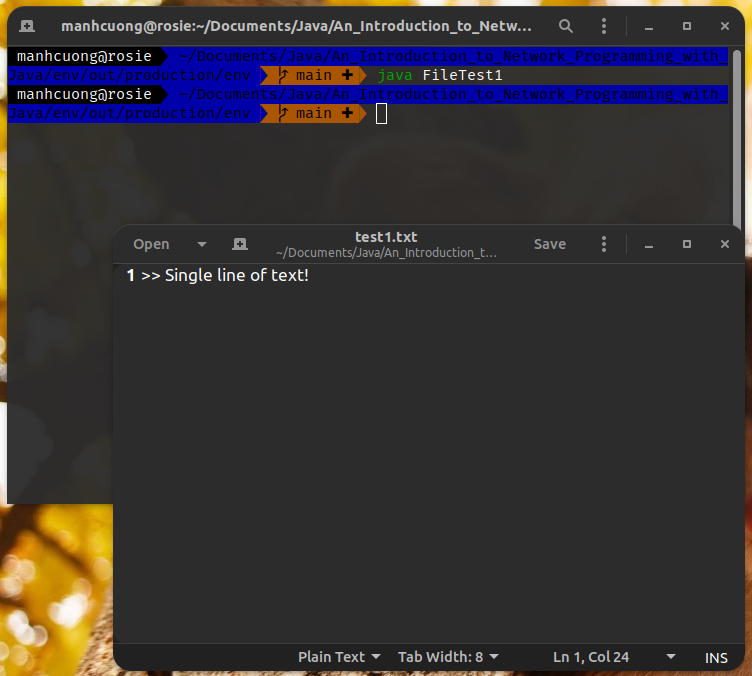
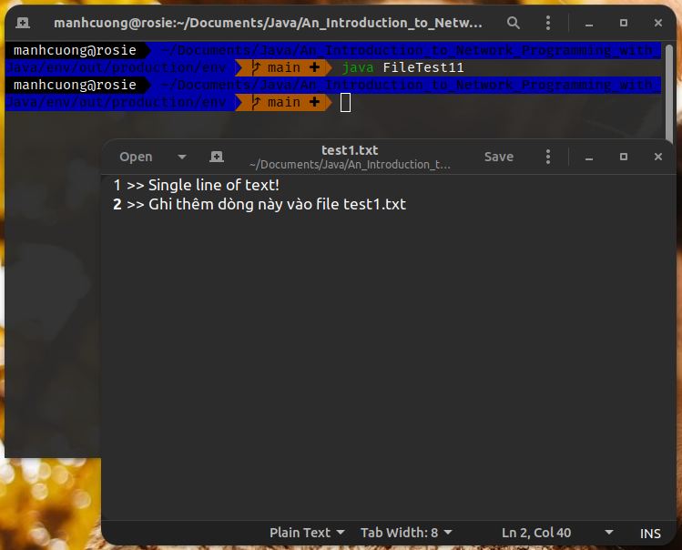
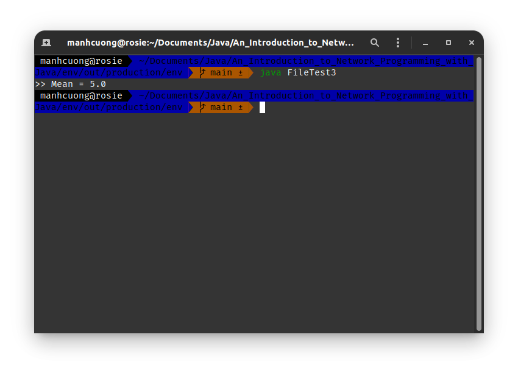
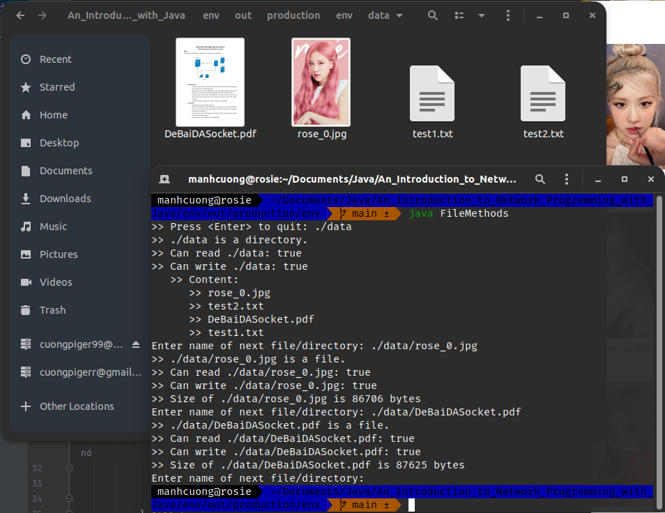
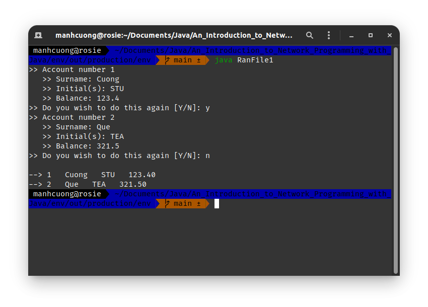
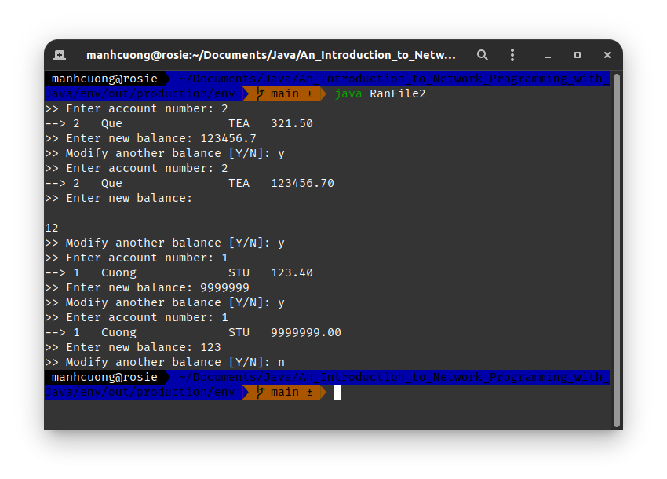
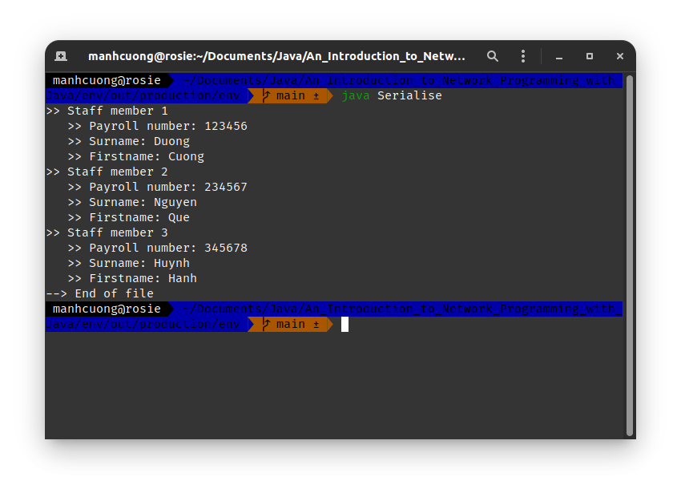
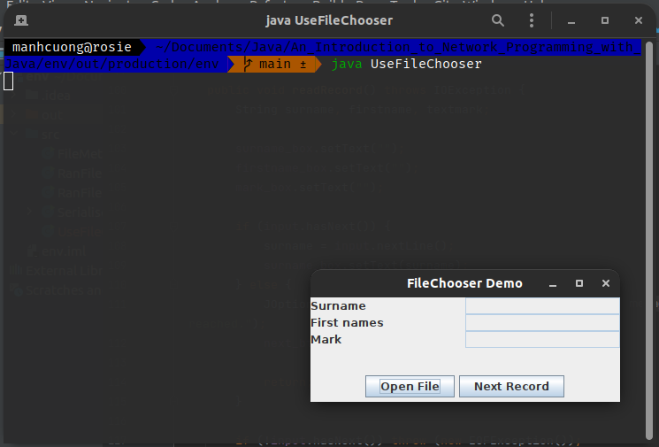
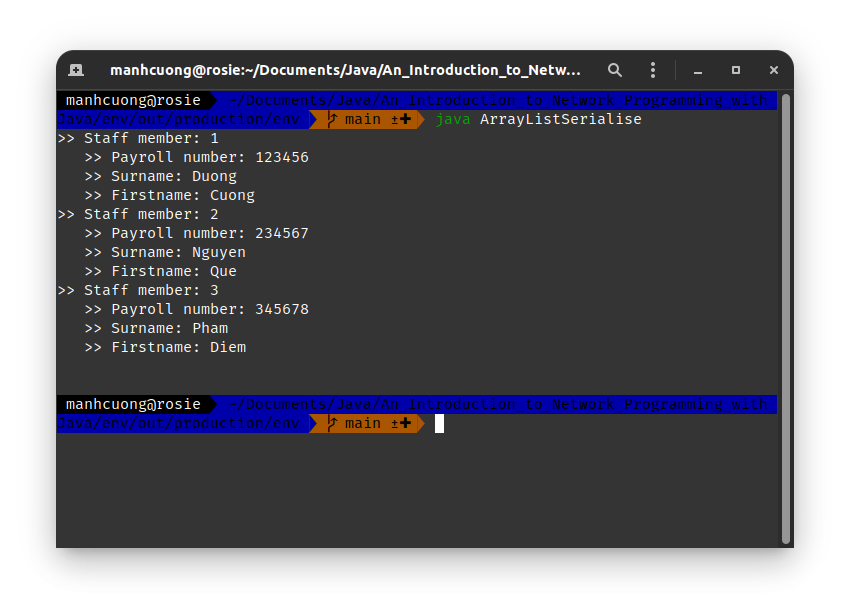
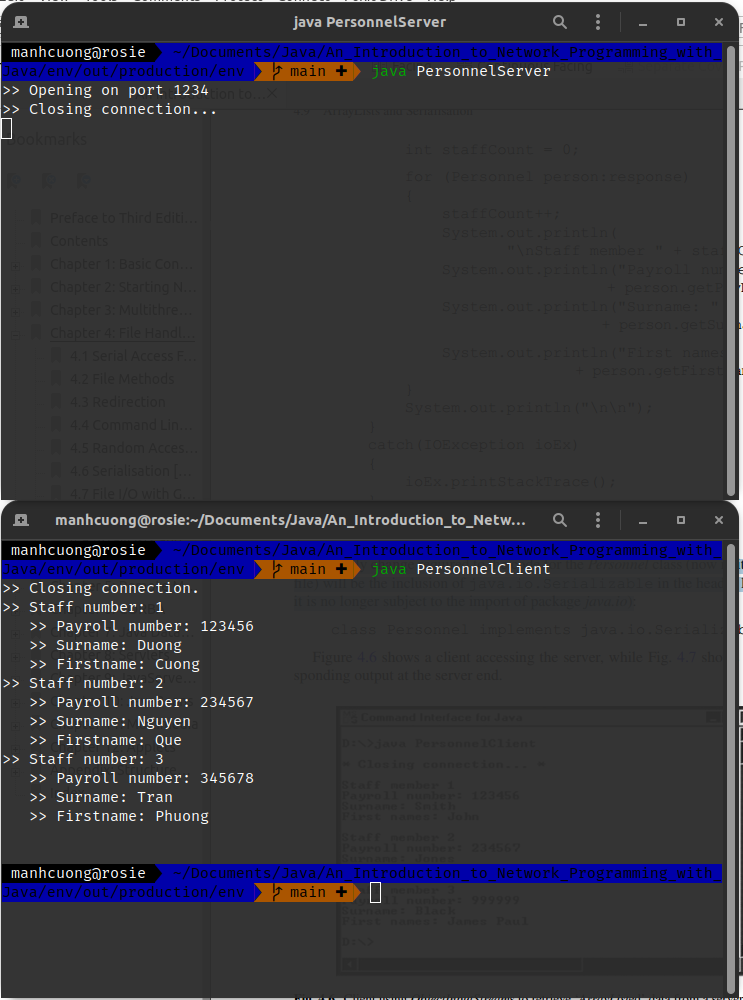

# 1. Serial Access Files
* Dưới đây là vi dụ về ghi file sử dụng Java.
###### [FileTest1.java](FileTest1.java)
```java
import java.io.*;

public class FileTest1 {
    public static void main(String[] args) throws IOException {
        String file_name = "./data/test1.txt";
        PrintWriter output = new PrintWriter(new File(file_name));
        output.println(">> Single line of text!"); // ghi ra file dòng này
        output.close();
    }
}
```


> * Nếu file `test1.txt` chưa có, thì nó sẽ Java sẽ tự tao ra và ghi vào.
> * Nếu file `test1.txt` đã có, thì nó bị ghi đè.

<hr>

* Code bên dưới cho phép ta ghi thêm nội dung vào file `test1.txt`.
###### [FileTest11.java](FileTest11.java)
```java
import java.io.FileWriter;
import java.io.IOException;
import java.io.PrintWriter;

public class FileTest11 {
    public static void main(String[] args) throws IOException {
        String file_name = "./data/test1.txt";
        PrintWriter output = new PrintWriter(new FileWriter(file_name, true));
        output.println(">> Ghi thêm dòng này vào file test1.txt");
        output.close();
    }
}
```


<hr>

* Chương trình dưới đây cho phép ta chọn file muốn ghi đồng thời cho phép ghi nhiều dòng vào file chỉ định.
###### [FileTest2.java](FileTest2.java)
```java
import java.io.*;
import java.util.*;

public class FileTest2 {
    public static void main(String[] args) throws IOException {
        String file_name;
        int mark;
        Scanner input = new Scanner(System.in);

        System.out.print(">> Enter file name: ");
        file_name = input.nextLine().trim();
        PrintWriter output = new PrintWriter(new File(file_name));
        System.out.println("Ten marks needed");

        for (int i = 1; i < 11; ++i) {
            System.out.print("   >> Enter mark " + i + ": ");
            mark = input.nextInt();
            output.println(mark);
            output.flush();
        }

        output.close();
    }
}
```

> * Tuy nhiên khi ta chạy lần nữa thì file `test2.txt` sẽ bị ghi đè.

<hr>

* Chương trình dưới đây sẽ đọc file `test2.txt` ở trên và tiến hành đọc từng dòng sau đó tính mean.
###### [FileTest3.java](FileTest3.java)
```java
import java.io.*;
import java.util.*;

public class FileTest3 {
    public static void main(String[] args) throws IOException {
        int mark, total = 0, count = 0;
        String file_name = "./data/test2.txt";
        Scanner input = new Scanner(new File(file_name));

        while (input.hasNext()) { // kiểm tra cuối file hay chưa
            mark = input.nextInt();
            total += mark;
            count += 1;
        }

        input.close();

        System.out.println(">> Mean = " + (float) (total / count));
    }
}
```


# 2. File Methods
* Class `File` có một vài p.thức dc dùng phổ biến _(xem sách trang 93)_, dưới đây là chương trình nho nhỏ demo một vài p.thức này.
###### [FileMethods.java](FileMethods.java)
```java
import java.io.*;
import java.util.*;

public class FileMethods {
    public static void main(String[] args) throws IOException {
        String file_name;
        Scanner input = new Scanner(System.in);
        System.out.print(">> Press <Enter> to quit: ");
        file_name = input.nextLine().trim();

        while (!file_name.isEmpty()) {
            File file_dir = new File(file_name);

            if (!file_dir.exists()) { // nếu file này chưa tồn tại
                System.out.println(">> " + file_name + " does not exist.");
                break;
            }

            System.out.print(">> " + file_name + " is a ");
            if (file_dir.isFile()) { // kiểm tra file có phải là file hay ko hay là thư mục hoặc qq j khác
                System.out.println("file.");
            } else {
                System.out.println("directory.");
            }

            System.out.println(">> Can read " + file_name + ": " + file_dir.canRead());
            System.out.println(">> Can write " + file_name + ": " + file_dir.canWrite());

            if (file_dir.isDirectory()) { // nếu là thư mục thì tiến hành đọc tên các file bên trong nó
                System.out.println("   >> Content: ");
                String[] file_lst = file_dir.list(); // lấy danh sách các file bên trong nó
                for (var file : file_lst) {
                    System.out.println("      >> " + file);
                }
            } else {
                System.out.println(">> Size of " + file_name + " is " + file_dir.length() + " bytes");
            }

            System.out.print("Enter name of next file/directory: ");
            file_name = input.nextLine().trim();
        }

        input.close();
    }
}
```


# 3. Redirection
# 4. Command Line Parameters
# 5. Random Access Files
* Kĩ thuật này cho phép ta đọc/ghi tại bất kì vị trí nào trong file.
* Ví dụ dưới đây dùng RandomAccessFile để ghi thông tin account vào `accounts.dat`.
###### [RanFile1.java](RanFile1.java)
```java
import java.io.*;
import java.util.*;

public class RanFile1 {
    private static final int REC_SIZE = 48;
    private static final int SURNAME_SIZE = 15;
    private static final int NUM_INITS = 3;
    private static long acct_num = 0;
    private static String surname, initials;
    private static float balance;

    public static void writeRecord(RandomAccessFile file) throws IOException {
        long file_pos = (acct_num - 1) * REC_SIZE;
        file.seek(file_pos); // move cursor
        file.writeLong(acct_num);
        writeString(file, surname, SURNAME_SIZE);
        writeString(file, initials, NUM_INITS);
        file.writeFloat(balance);
    }

    public static void writeString(RandomAccessFile file, String text, int fixed_size) throws IOException {
        int size = text.length();

        if (size <= fixed_size) {
            file.writeChars(text);
            for (int i = size; i < fixed_size; ++i) {
                file.writeChar(' ');
            }
        } else {
            file.writeChars(text.substring(0, fixed_size));
        }
    }

    public static void showRecords(RandomAccessFile file) throws IOException {
        long num_records = file.length() / REC_SIZE;
        file.seek(0);

        for (int i = 0; i < num_records; ++i) {
            acct_num = file.readLong();
            surname = readString(file, SURNAME_SIZE);
            initials = readString(file, NUM_INITS);
            balance = file.readFloat();

            System.out.printf("--> " + acct_num + "   " + surname + "   " + initials + "   " + "%.2f %n", balance);
        }
    }

    public static String readString(RandomAccessFile file, int fixed_size) throws IOException {
        String value = "";

        for (int i = 0; i < fixed_size; ++i) value += file.readChar();
        return value.trim();
    }

    public static void main(String[] args) throws IOException {
        String file_name = "./data/accounts.dat";
        RandomAccessFile ran_accts = new RandomAccessFile(file_name, "rw");
        Scanner input = new Scanner(System.in);
        String reply = "y";

        do {
            System.out.println(">> Account number " + ++acct_num);
            System.out.print("   >> Surname: ");
            surname = input.nextLine();
            System.out.print("   >> Initial(s): ");
            initials = input.nextLine();
            System.out.print("   >> Balance: ");
            balance = input.nextFloat();

            input.nextLine(); // loại bỏ dấu xuống dòng

            writeRecord(ran_accts);
            System.out.print(">> Do you wish to do this again [Y/N]: ");
            reply = input.nextLine().trim().toLowerCase();
        } while (reply.equals("y"));

        System.out.println();
        showRecords(ran_accts);
        ran_accts.close();
    }
}
```


<hr>

* Dưới đây là chương trình cho phép đọc file `accounts.dat` đồng thời cho phép chỉnh sửa giá trị `balance`.
###### [RanFile2.java](RanFile2.java)
```java
import java.io.*;
import java.util.*;

public class RanFile2 {
    private static final int REC_SIZE = 48;
    private static final int SURNAME_SIZE = 15;
    private static final int NUM_INITS = 3;
    private static long acct_num = 0;
    private static String surname, initials;
    private static float balance;

    public static void showRecord(RandomAccessFile file) throws IOException {
        long num_records = file.length() / REC_SIZE;
        file.seek((acct_num - 1) * REC_SIZE);

        acct_num = file.readLong();
        surname = readString(file, SURNAME_SIZE);
        initials = readString(file, NUM_INITS);
        balance = file.readFloat();

        System.out.printf("--> " + acct_num + "   " + surname + "   " + initials + "   " + "%.2f %n", balance);
    }

    public static String readString(RandomAccessFile file, int fixed_size) throws IOException {
        StringBuffer buffer = new StringBuffer();

        for (int i = 0; i < fixed_size; ++i) buffer.append(file.readChar());
        return buffer.toString();
    }

    public static void main(String[] args) throws IOException {
        String file_name = "./data/accounts.dat";
        Scanner input = new Scanner(System.in);
        RandomAccessFile ran_accts = new RandomAccessFile(file_name, "rw");
        long num_records = ran_accts.length() / REC_SIZE;
        String reply;
        long current_pos;

        do {
            System.out.print(">> Enter account number: ");
            acct_num = input.nextLong();

            while ((acct_num < 1) || (acct_num > num_records)) {
                System.out.println("==> Invalid number!");
                System.out.print(">> Enter account number: ");
                acct_num = input.nextLong();
            }

            showRecord(ran_accts);
            System.out.print(">> Enter new balance: ");
            balance = input.nextFloat();
            input.nextLine();

            current_pos = ran_accts.getFilePointer();
            ran_accts.seek(current_pos - 4); // float tốn 4 bytes vùng nhớ
            ran_accts.writeFloat(balance);
            System.out.print(">> Modify another balance [Y/N]: ");
            reply = input.nextLine().trim().toLowerCase();
        } while (reply.equals("y"));

        ran_accts.close();
    }
}
```


# 6. Serialisation [U.S. Spelling Serialization]
* Kĩ thuật này dùng để chuyển đổi một object sang byte stream để thuận tiện cho lưu trữ và đọc dữ liệu.
* Ví dụ dưới đây ta đang tiến hành ghi và đọc thông tin của các nhân viên dc lưu trong class `Personnel`.
###### [Serialise.java](Serialise.java)
```java
import java.io.*;

class Personnel implements Serializable {
    private long payroll_num;
    private String surname;
    private String firstname;

    public Personnel(long p, String s, String f) {
        payroll_num = p;
        surname = s;
        firstname = f;
    }

    public long get_payroll_num() {
        return payroll_num;
    }

    public String get_surname() {
        return surname;
    }

    public String get_firstname() {
        return firstname;
    }

    public void set_surname(String s) {
        surname = s;
    }
}

public class Serialise {
    public static void main(String[] args) throws IOException, ClassNotFoundException {
        String file_name = "./data/personnel.dat";
        ObjectOutputStream out_stream = new ObjectOutputStream(new FileOutputStream(file_name));
        Personnel[] staff = {
                new Personnel(123456, "Duong", "Cuong"),
                new Personnel(234567, "Nguyen", "Que"),
                new Personnel(345678, "Huynh", "Hanh")
        };

        for (int i = 0; i < staff.length; ++i) {
            out_stream.writeObject(staff[i]);
        }

        out_stream.close();
        ObjectInputStream in_stream = new ObjectInputStream(new FileInputStream(file_name));

        int staff_count = 0;

        try {
            do {
                Personnel person = (Personnel) in_stream.readObject();
                staff_count += 1;

                System.out.println(">> Staff member " + staff_count);
                System.out.println("   >> Payroll number: " + person.get_payroll_num());
                System.out.println("   >> Surname: " + person.get_surname());
                System.out.println("   >> Firstname: " + person.get_firstname());
            } while (true);
        } catch (EOFException err) {
            System.out.println("--> End of file");
            in_stream.close();
        }
    }
}
```


# 7. File I/O with GUIs
###### [UseFileChooser.java](UseFileChooser.java)
```java
import java.awt.*;
import java.awt.event.*;
import javax.swing.*;
import java.io.*;
import java.util.*;

public class UseFileChooser extends JFrame implements ActionListener {
    private JPanel display_pnl, button_pnl;
    private JLabel surname_lbl, firstname_lbl, mark_lbl;
    private JTextField surname_box, firstname_box, mark_box;
    private JButton open_btn, next_btn;
    private Scanner input;

    public UseFileChooser() {
        setTitle("FileChooser Demo");
        setLayout(new BorderLayout());
        display_pnl = new JPanel();
        display_pnl.setLayout(new GridLayout(3,2));
        surname_lbl = new JLabel("Surname");
        firstname_lbl = new JLabel("First names");
        mark_lbl = new JLabel("Mark");
        surname_box= new JTextField();
        firstname_box = new JTextField();
        mark_box = new JTextField();
        surname_box.setEditable(false);
        firstname_box.setEditable(false);
        mark_box.setEditable(false);
        display_pnl.add(surname_lbl);
        display_pnl.add(surname_box);
        display_pnl.add(firstname_lbl);
        display_pnl.add(firstname_box);
        display_pnl.add(mark_lbl);
        display_pnl.add(mark_box);
        add(display_pnl, BorderLayout.NORTH);
        button_pnl = new JPanel();
        button_pnl.setLayout(new FlowLayout());
        open_btn = new JButton("Open File");
        open_btn.addActionListener(this);
        next_btn = new JButton("Next Record");
        next_btn.addActionListener(this);
        next_btn.setEnabled(false);
        button_pnl.add(open_btn);
        button_pnl.add(next_btn);
        add(button_pnl, BorderLayout.SOUTH);

        addWindowListener(
                new WindowAdapter() {
                    public void windowClosing(WindowEvent event) {
                        if (input != null) // file is opening.
                            input.close();

                        System.exit(0);
                    }
                }
        );
    }

    public void actionPerformed(ActionEvent ev) {
        if (ev.getSource() == open_btn) {
            try {
                openFile();
            } catch (IOException err) {
                JOptionPane.showMessageDialog(this, "Unable to open file!");
            }
        } else {
            try {
                readRecord();
            } catch (EOFException err) {
                next_btn.setEnabled(false);
                JOptionPane.showMessageDialog(this, "In complete record!\nEnd of file reached.");
            } catch (IOException err) {
                JOptionPane.showMessageDialog(this, "Unable to read file!");
            }
        }
    }

    public void openFile() throws IOException {
        if (input != null) {
            input.close();
            input = null;
        }

        JFileChooser file_chooser = new JFileChooser();
        file_chooser.setFileSelectionMode(JFileChooser.FILES_ONLY);

        int selection = file_chooser.showOpenDialog(null);
        if (selection == JFileChooser.CANCEL_OPTION) return;

        File results = file_chooser.getSelectedFile();
        if (results == null || results.getName().isEmpty()) {
            JOptionPane.showMessageDialog(this, "Invalid selection!");
            return;
        }

        input = new Scanner(results);
        readRecord(); // read and display first record
        next_btn.setEnabled(true);
    }

    public void readRecord() throws IOException {
        String surname, firstname, textmark;

        surname_box.setText("");
        firstname_box.setText("");
        mark_box.setText("");

        if (input.hasNext()) {
            surname = input.nextLine();
            surname_box.setText(surname);
        } else {
            JOptionPane.showMessageDialog(this, "End of file reached.");
            next_btn.setEnabled(false);

            return;
        }

        if (!input.hasNext()) throw (new EOFException());

        // otherwise
        firstname = input.nextLine();
        firstname_box.setText(firstname);

        if (!input.hasNext()) throw (new EOFException());

        // otherwise
        textmark = input.nextLine();
        mark_box.setText(textmark);
    }

    public static void main(String[] args) {
        UseFileChooser frame = new UseFileChooser();
        frame.setSize(350, 150);
        frame.setVisible(true);
    }
}
```


# 8. ArrayLists
# 9. ArrayLists and Serialisation
###### [ArrayListSerialise.java](ArrayListSerialise.java)
```java
import java.io.*;
import java.util.*;

class Personnel implements Serializable {
    private long payroll_num;
    private String surname;
    private String firstname;

    public Personnel(long p, String s, String f) {
        payroll_num = p;
        surname = s;
        firstname = f;
    }

    public long get_payroll_num() {
        return payroll_num;
    }

    public String get_surname() {
        return surname;
    }

    public String get_firstname() {
        return firstname;
    }

    public void set_surname(String s) {
        surname = s;
    }
}

public class ArrayListSerialise {
    public static void main(String[] args) throws IOException, ClassNotFoundException {
        String file_name = "./data/personnel_list.dat";
        ObjectOutputStream out_stream = new ObjectOutputStream(new FileOutputStream(file_name));
        ArrayList<Personnel> staff_list_out = new ArrayList<>();
        ArrayList<Personnel> staff_list_in = new ArrayList<>();

        Personnel[] staff = {
                new Personnel(123456, "Duong", "Cuong"),
                new Personnel(234567, "Nguyen", "Que"),
                new Personnel(345678, "Pham", "Diem")
        };

        for (var ob : staff) staff_list_out.add(ob);
        out_stream.writeObject(staff_list_out);
        out_stream.close();

        ObjectInputStream in_stream = new ObjectInputStream(new FileInputStream(file_name));
        int staff_count = 0;

        try {
            staff_list_in = (ArrayList<Personnel>) in_stream.readObject();
            for (var person : staff_list_in) {
                System.out.println(">> Staff member: " + ++staff_count);
                System.out.println("   >> Payroll number: " + person.get_payroll_num());
                System.out.println("   >> Surname: " + person.get_surname());
                System.out.println("   >> Firstname: " + person.get_firstname());
            }

            System.out.println("\n");
        } catch (EOFException err) {
            System.out.println("--> End of file.");
            in_stream.close();
        }
    }
}
```


<hr>

* Dưới đây là một chương trình dùng để lấy thông tin của các nhân viên dc lưu tại server và dc client lấy về xem thông qua kết nôi socket.

###### [PersonnelServer.java](PersonnelServer.java)
```java
import java.io.*;
import java.net.*;
import java.util.*;

class Personnel implements Serializable {
    private long payroll_num;
    private String surname;
    private String firstname;

    public Personnel(long p, String s, String f) {
        payroll_num = p;
        surname = s;
        firstname = f;
    }

    public long get_payroll_num() {
        return payroll_num;
    }

    public String get_surname() {
        return surname;
    }

    public String get_firstname() {
        return firstname;
    }

    public void set_surname(String s) {
        surname = s;
    }
}

public class PersonnelServer {
    private static ServerSocket server_socket;
    private static final int PORT = 1234;
    private static Socket socket;
    private static ArrayList<Personnel> staff_list_out;
    private static Scanner in_stream;
    private static ObjectOutputStream out_stream;

    private static void startServer() {
        do {
            try {
                socket = server_socket.accept();
                in_stream = new Scanner(socket.getInputStream());
                out_stream = new ObjectOutputStream(socket.getOutputStream());

                String message = in_stream.nextLine();
                if (message.equals("SEND PERSONNEL DETAILS")) {
                    out_stream.writeObject(staff_list_out);
                    out_stream.close();
                }

                System.out.println(">> Closing connection...");
                socket.close();
            } catch (IOException err) {
                err.printStackTrace();
            }
        } while (true);
    }

    public static void main(String[] args) {
        System.out.println(">> Opening on port " + PORT);

        try {
            server_socket = new ServerSocket(PORT);
        } catch (IOException err) {
            System.out.println("==> Unable to attach to port");
            System.exit(1);
        }

        staff_list_out = new ArrayList<>();
        Personnel[] staff = {
                new Personnel(123456, "Duong", "Cuong"),
                new Personnel(234567, "Nguyen", "Que"),
                new Personnel(345678, "Tran", "Phuong")
        };

        for (var person : staff) staff_list_out.add(person);
        startServer();
    }
}
```

###### [PersonnelClient.java](PersonnelClient.java)
```java
import java.io.*;
import java.net.*;
import java.util.*;

public class PersonnelClient {
    private static InetAddress host;
    private static final int PORT = 1234;

    private static void talkToServer() throws ClassNotFoundException {
        try {
            Socket socket = new Socket(host, PORT);
            ObjectInputStream in_stream = new ObjectInputStream(socket.getInputStream());
            PrintWriter out_stream = new PrintWriter(socket.getOutputStream(), true);
            Scanner user_entry = new Scanner(System.in);
            out_stream.println("SEND PERSONNEL DETAILS");
            ArrayList<Personnel> response = (ArrayList<Personnel>) in_stream.readObject();
            System.out.println(">> Closing connection.");
            socket.close();

            int staff_count = 0;
            for (var person : response) {
                System.out.println(">> Staff number: " + ++staff_count);
                System.out.println("   >> Payroll number: " + person.get_payroll_num());
                System.out.println("   >> Surname: " + person.get_surname());
                System.out.println("   >> Firstname: " + person.get_firstname());
            }

            System.out.println("\n");
        } catch (IOException err) {
            err.printStackTrace();
        }
    }

    public static void main(String[] args) throws ClassNotFoundException {
        try {
            host = InetAddress.getLocalHost();
        } catch (UnknownHostException err) {
            System.out.println("==> Host ID not found!");
            System.exit(1);
        }

        talkToServer();
    }
}
```
