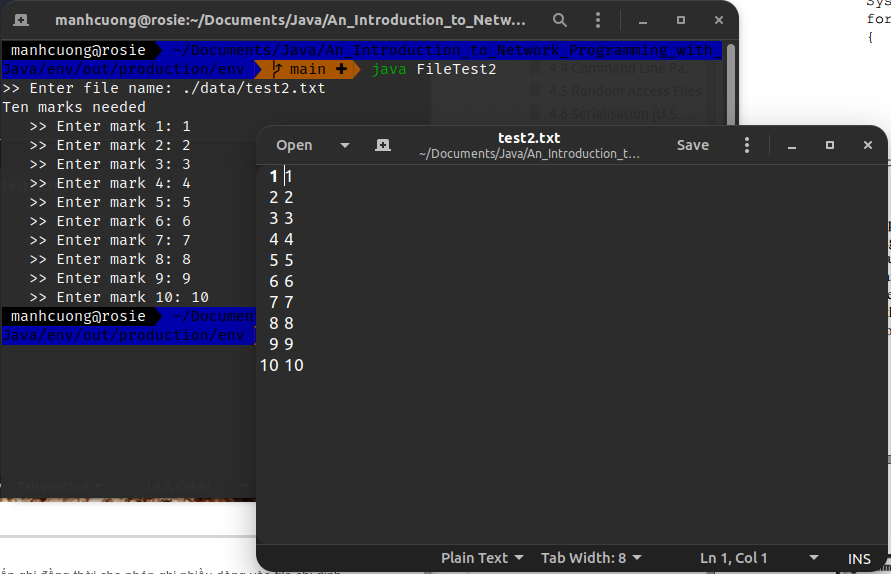

# 1. Serial Access Files
* Dưới đây là vi dụ về ghi file sử dụng Java.
###### [FileTest1.java](FileTest1.java)
```java
import java.io.*;

public class FileTest1 {
    public static void main(String[] args) throws IOException {
        String file_name = "./data/test1.txt";
        PrintWriter output = new PrintWriter(new File(file_name));
        output.println(">> Single line of text!"); // ghi ra file dòng này
        output.close();
    }
}
```


> * Nếu file `test1.txt` chưa có, thì nó sẽ Java sẽ tự tao ra và ghi vào.
> * Nếu file `test1.txt` đã có, thì nó bị ghi đè.

<hr>

* Code bên dưới cho phép ta ghi thêm nội dung vào file `test1.txt`.
###### [FileTest11.java](FileTest11.java)
```java
import java.io.FileWriter;
import java.io.IOException;
import java.io.PrintWriter;

public class FileTest11 {
    public static void main(String[] args) throws IOException {
        String file_name = "./data/test1.txt";
        PrintWriter output = new PrintWriter(new FileWriter(file_name, true));
        output.println(">> Ghi thêm dòng này vào file test1.txt");
        output.close();
    }
}
```


<hr>

* Chương trình dưới đây cho phép ta chọn file muốn ghi đồng thời cho phép ghi nhiều dòng vào file chỉ định.
###### [FileTest2.java](FileTest2.java)
```java
import java.io.*;
import java.util.*;

public class FileTest2 {
    public static void main(String[] args) throws IOException {
        String file_name;
        int mark;
        Scanner input = new Scanner(System.in);

        System.out.print(">> Enter file name: ");
        file_name = input.nextLine().trim();
        PrintWriter output = new PrintWriter(new File(file_name));
        System.out.println("Ten marks needed");

        for (int i = 1; i < 11; ++i) {
            System.out.print("   >> Enter mark " + i + ": ");
            mark = input.nextInt();
            output.println(mark);
            output.flush();
        }

        output.close();
    }
}
```

> * Tuy nhiên khi ta chạy lần nữa thì file `test2.txt` sẽ bị ghi đè.

<hr>

* Chương trình dưới đây sẽ đọc file `test2.txt` ở trên và tiến hành đọc từng dòng sau đó tính mean.
###### [FileTest3.java](FileTest3.java)
```java
import java.io.*;
import java.util.*;

public class FileTest3 {
    public static void main(String[] args) throws IOException {
        int mark, total = 0, count = 0;
        String file_name = "./data/test2.txt";
        Scanner input = new Scanner(new File(file_name));

        while (input.hasNext()) { // kiểm tra cuối file hay chưa
            mark = input.nextInt();
            total += mark;
            count += 1;
        }

        input.close();

        System.out.println(">> Mean = " + (float) (total / count));
    }
}
```


# 2. File Methods
* Class `File` có một vài p.thức dc dùng phổ biến _(xem sách trang 93)_, dưới đây là chương trình nho nhỏ demo một vài p.thức này.
###### [FileMethods.java](FileMethods.java)
```java
import java.io.*;
import java.util.*;

public class FileMethods {
    public static void main(String[] args) throws IOException {
        String file_name;
        Scanner input = new Scanner(System.in);
        System.out.print(">> Press <Enter> to quit: ");
        file_name = input.nextLine().trim();

        while (!file_name.isEmpty()) {
            File file_dir = new File(file_name);

            if (!file_dir.exists()) { // nếu file này chưa tồn tại
                System.out.println(">> " + file_name + " does not exist.");
                break;
            }

            System.out.print(">> " + file_name + " is a ");
            if (file_dir.isFile()) { // kiểm tra file có phải là file hay ko hay là thư mục hoặc qq j khác
                System.out.println("file.");
            } else {
                System.out.println("directory.");
            }

            System.out.println(">> Can read " + file_name + ": " + file_dir.canRead());
            System.out.println(">> Can write " + file_name + ": " + file_dir.canWrite());

            if (file_dir.isDirectory()) { // nếu là thư mục thì tiến hành đọc tên các file bên trong nó
                System.out.println("   >> Content: ");
                String[] file_lst = file_dir.list(); // lấy danh sách các file bên trong nó
                for (var file : file_lst) {
                    System.out.println("      >> " + file);
                }
            } else {
                System.out.println(">> Size of " + file_name + " is " + file_dir.length() + " bytes");
            }

            System.out.print("Enter name of next file/directory: ");
            file_name = input.nextLine().trim();
        }

        input.close();
    }
}
```


# 3. Redirection

